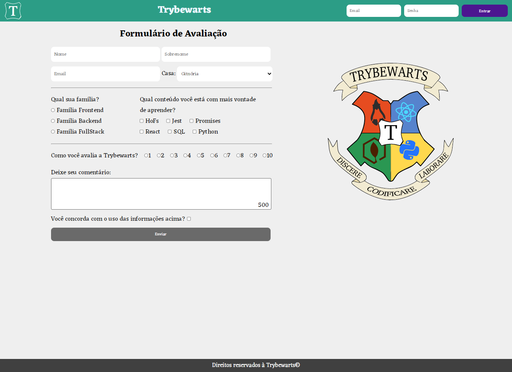

# Boas-vindas ao repositório do projeto Trybewarts Wizarding School! 🧙

## 💻 Projeto

Neste projeto, desenvolvi uma página de formulário da Escola de Magia de Trybewarts, em que as pessoas estudantes poderão enviar seus feedbacks sobre ela. O tema desse projeto é baseado na obra 'Harry Potter', de J. K. Rowling, já que programar é o mais próximo que podemos chegar de algo verdadeiramente mágico!

Projeto referente ao módulo de fundamentos da Trybe (https://www.betrybe.com/) desenvolvido em equipe.

O resultado da aplicação pode ser acessado através da seguinte URL: [https://frantend.github.io/trybewarts](https://frantend.github.io/trybewarts/)

## 🎨 Layout

## 👩‍💻 Requisitos e Habilidades

Criar uma página web utilizando HTML.
Estilizar a página utilizando conceitos de CSS Flexbox.
Criar um formulário de avaliação.
Habilitar o botão "Enviar" após a validação do checkbox utilizando JavaScript.
Testar o código utilizando ESLint e Stylelint.
Versionamento em equipe.